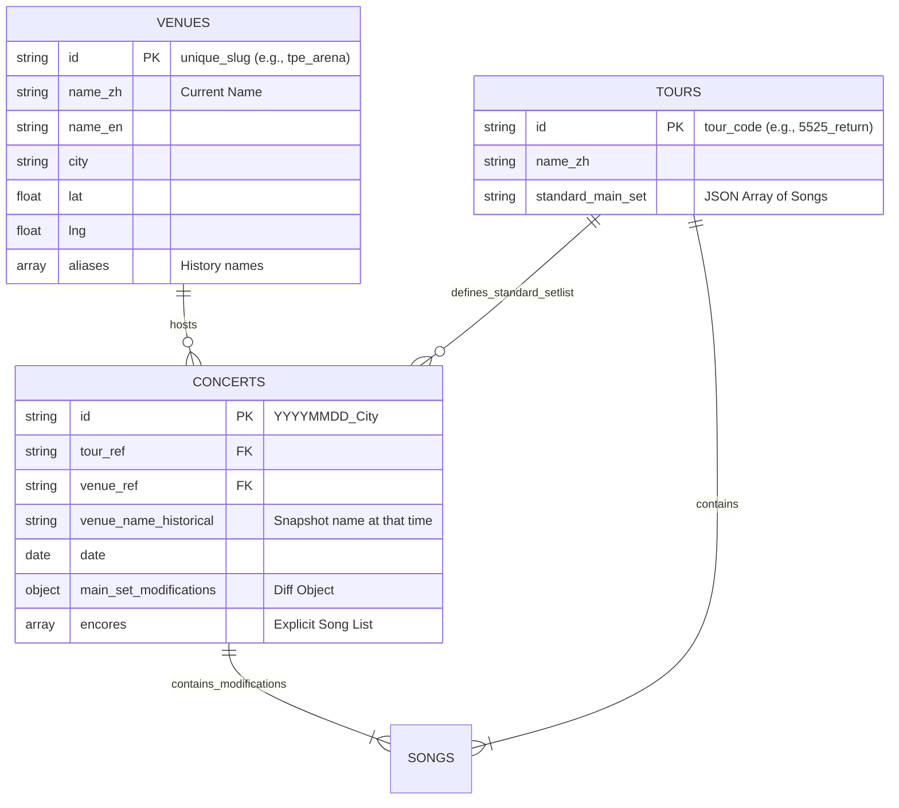

# Database Design Specification: Mayday Chronicle

**Version**: 1.0.0
**Last Updated**: 2026-02-17
**Status**: Static JSON Implementation (Schema-Ready for SQL Migration)

## 1. 設計哲學 (Design Philosophy)

本專案採用 **「關聯式模型 (Relational Model)」** 進行資料設計，即使目前物理儲存層為靜態 JSON 檔案。

核心原則如下：

- **單一真理來源 (Single Source of Truth)**
  場館資訊、巡迴標準歌單均獨立儲存，避免多處維護導致資料不一致。例如：修正一個場館座標，所有關聯場次自動更新。

- **混合式歌單邏輯 (Hybrid Setlist Logic)**
  - **主歌單 (Main Set)**：採 `Inheritance + Diff` (繼承+差異) 模式。只儲存與標準歌單不同的部分，大幅節省儲存空間並保留資料結構的清晰度。
  - **安可 (Encore)**：採 `Explicit List` (明確列舉) 模式。由於安可曲目高度隨機且長度不一，直接列舉比差異比對更易於維護與閱讀。

- **時空快照 (Spatio-Temporal Snapshot)**
  預留 `venue_name_historical` 等欄位，應對場館更名或拆除的歷史情境，確保「回到那一天」的歷史準確性。

## 2. 實體關係圖 (ER Model)



## 3. 資料結構定義 (Schema Definitions)

### 3.1 Venues (場館主檔)

儲存地理資訊與現有名稱。此檔為全域共用。

| Field         | Type        | Required | Description                                                  |
| :------------ | :---------- | :------- | :----------------------------------------------------------- |
| `id`          | String (PK) | Yes      | 唯一識別碼，格式建議：`city_venue_slug` (e.g., `tpe_dome`)。 |
| `name`        | Object      | Yes      | 多語言名稱物件 `{ zh: string, en: string }`。                |
| `city`        | String      | Yes      | 城市名稱 (e.g., `Taipei`)。                                  |
| `coordinates` | Array       | Yes      | `[latitude, longitude]` (WGS-84 標準)。                      |
| `aliases`     | Array       | No       | 字串陣列，儲存該場館的別名或舊名，利於搜尋。                 |

### 3.2 Tours (巡迴主檔)

儲存巡迴主題與「標準歌單骨架」。

| Field               | Type        | Required | Description                                   |
| :------------------ | :---------- | :------- | :-------------------------------------------- |
| `id`                | String (PK) | Yes      | 巡迴代碼 (e.g., `5525_return`)。              |
| `name`              | Object      | Yes      | 多語言名稱物件 `{ zh: string, en: string }`。 |
| `period`            | String      | Yes      | 巡迴年份區間 (e.g., `2023-Present`)。         |
| `description`       | String      | No       | 巡迴簡介。                                    |
| `standard_main_set` | Array       | Yes      | 標準歌單陣列 (不含安可)，由 `Song` 物件組成。 |

### 3.3 Concerts (場次明細)

儲存具體的演出資訊，是資料量最大的檔案。

| Field                    | Type        | Required | Description                                                        |
| :----------------------- | :---------- | :------- | :----------------------------------------------------------------- |
| `id`                     | String (PK) | Yes      | 場次 ID (e.g., `20250511_hk`)。                                    |
| `tour_ref`               | String (FK) | Yes      | 關聯至 `Tours.id`，決定基本歌單。                                  |
| `venue_ref`              | String (FK) | Yes      | 關聯至 `Venues.id`，決定座標與當前名稱。                           |
| `venue_name_historical`  | String      | No       | **歷史快照**。若當年場館名稱與現在不同，填入此欄位 (UI 優先顯示)。 |
| `date`                   | String      | Yes      | ISO 8601 格式 `YYYY-MM-DD`。                                       |
| `time_info`              | Object      | No       | 包含 `start_time`, `timezone`。                                    |
| `main_set_modifications` | Object      | No       | 定義如何修改標準歌單 (Added/Removed)。                             |
| `encores`                | Array       | No       | 安可曲陣列，包含 `level` (幾安) 與 `songs`。                       |
| `links`                  | Object      | No       | 外部連結 (YouTube, News)。                                         |

### 3.4 共用物件：Song (歌曲)

嵌入在 `Tours` 與 `Concerts` 中的最小單位。

```typescript
interface Song {
  name: string; // 歌名 (e.g., "OAOA")
  is_medley?: boolean; // 是否為組曲 (e.g., "終結孤單 + 憨人")
  is_cover?: boolean; // 是否為翻唱 (UI 顯示灰色)
  is_request?: boolean; // 是否為點歌 (UI 顯示 Tag)
  note?: string; // 備註 (e.g., "feat. Energy", "VCR: 巴士")
}
```

## 4. 資料範例 (JSON Examples)

### 4.1 Venues Example

```json
{
  "tpe_dome": {
    "id": "tpe_dome",
    "name": { "zh": "臺北大巨蛋", "en": "Taipei Dome" },
    "city": "Taipei",
    "coordinates": [25.0401, 121.5583],
    "aliases": ["遠雄巨蛋"]
  }
}
```

### 4.2 Tours Example

```json
[
  {
    "id": "5525_return",
    "name": { "zh": "5525 回到那一天", "en": "5525 Return to That Day" },
    "standard_main_set": [
      { "seq": 1, "name": "OAOA" },
      { "seq": 2, "name": "孫悟空" }
    ]
  }
]
```

### 4.3 Concerts Example

```json
[
  {
    "id": "20250628_taipei",
    "tour_ref": "5525_return",
    "venue_ref": "tpe_dome",
    "venue_name_historical": "臺北大巨蛋",
    "date": "2025-06-28",
    "main_set_modifications": {
      "added": [
        {
          "after_seq": 19,
          "songs": [{ "name": "妳的神曲" }]
        }
      ]
    },
    "encores": [
      {
        "level": 1,
        "songs": [{ "name": "笑忘歌" }, { "name": "倔強" }]
      }
    ]
  }
]
```

## 5. 前端實作策略 (Frontend Implementation)

由於採用靜態檔案儲存關聯式資料，前端需實作 `Data Hydration` (資料組裝) 邏輯。

### 5.1 DataLoader Service

建立 `src/utils/dataLoader.ts` 負責以下工作：

1. **Parallel Fetching**: 使用 `Promise.all` 同時請求 `venues.json`, `tours.json`, `concerts.json`。
2. **Runtime Join**:
   - 讀取 `concert.venue_ref` -> 查找 `venues` Map -> 注入 `coordinates` 與 `city`。
   - 讀取 `concert.tour_ref` -> 查找 `tours` Map -> 注入 `standard_main_set`。
3. **Derived Fields**:
   - 計算 `display_venue_name`: 若 `venue_name_historical` 存在則使用之，否則使用 `venue.name.zh`。
   - 計算 `full_setlist`: 呼叫 `setlistHelper` 將標準歌單與 `main_set_modifications` 及 `encores` 合併。

### 5.2 效能優化 (Performance)

- **Venues Indexing**: 將 `venues.json` 轉換為 Map (Object) 結構，確保查詢複雜度為 O(1)。
- **Lazy Loading**: 若未來資料量過大，可依 `tour_ref` 將 `concerts` 拆分為多個檔案 (e.g., `concerts_5525.json`)，僅在需要時載入。
